Mermaid 是一个强大的工具，可以在 Markdown 中绘制各种图表。以下是一些常用的 Mermaid 语法和示例：

### 1. 流程图 (Flowchart)
使用 `graph` 关键字来创建流程图。以下是一个简单的示例：

```mermaid
graph TD;
    A[开始] --> B[过程1];
    B --> C{决策};
    C -->|是| D[过程2];
    C -->|否| E[结束];
```



- **A[开始]**: 方括号表示节点。
- **-->**: 表示箭头。
- **C{决策}**: 花括号表示决策节点。
- **|是|**: 条件路径。

### 2. 时序图 (Sequence Diagram)
使用 `sequenceDiagram` 关键字来创建时序图。以下是一个示例：

```mermaid
sequenceDiagram
    participant A as 用户
    participant B as 系统
    A->>B: 请求数据
    B-->>A: 返回数据
```



- **participant**: 定义参与者。
- **A->>B**: 实线箭头表示同步消息。
- **B-->>A**: 虚线箭头表示异步消息。

### 3. 类图 (Class Diagram)
使用 `classDiagram` 关键字来创建类图。以下是一个示例：

```mermaid
classDiagram
    class 动物 {
        +String 名字
        +int 年龄
        +void 吃()
    }
    class 狗 {
        +String 品种
        +void 吠()
    }
    动物 <|-- 狗
```

- **class**: 定义类。
- **+**: 表示公共成员。
- **<|--**: 表示继承关系。

### 4. 甘特图 (Gantt Chart)
使用 `gantt` 关键字来创建甘特图。以下是一个示例：

```mermaid
gantt
    title 项目计划
    dateFormat  YYYY-MM-DD
    section 设计
    任务1           :a1, 2024-01-01, 30d
    任务2           :after a1  , 20d
    section 开发
    任务3           :2024-02-01  , 20d
    任务4           :2024-02-15  , 25d
```



- **section**: 定义任务的分组。
- **任务1 :a1, 2024-01-01, 30d**: 定义任务名称、ID、开始日期和持续时间。

### 5. 饼图 (Pie Chart)
使用 `pie` 关键字来创建饼图。以下是一个示例：

```mermaid
pie
    title 饼图示例
    "苹果" : 40
    "香蕉" : 30
    "橙子" : 20
    "葡萄" : 10
```



- **title**: 定义图表标题。
- **"苹果" : 40**: 定义数据项和对应的值。

这些示例涵盖了 Mermaid 的一些基本用法。你可以根据需要调整和扩展这些语法来创建更复杂的图表。如果你有任何问题或需要进一步的帮助，请随时告诉我！😊

¹: [CSDN 博客](https://blog.csdn.net/m0_63456808/article/details/138942065)
²: [VoidKing](https://www.voidking.com/dev-markdown-mermaid-start/)
³: [Mermaid 中文网](https://mermaid.nodejs.cn/syntax/flowchart.html)

源: 与 Copilot 的对话， 2024/10/15
(1) markdown的mermaid用法及例子 - CSDN博客. https://blog.csdn.net/m0_63456808/article/details/138942065.
(2) 好好学Hexo：Markdown使用Mermaid绘图入门篇 | 好好学习的郝. https://www.voidking.com/dev-markdown-mermaid-start/.
(3) Mermaid 从入门到入土——Markdown 进阶语法. https://lazurite.vercel.app/Mermaid-grammer.
(4) Mermaid从入门到入土——Markdown进阶语法 - 知乎. https://zhuanlan.zhihu.com/p/355997933.
(5) 循序渐进-讲解Markdown进阶（Mermaid绘图）-附使用案例 .... https://blog.csdn.net/qq_57508808/article/details/136110461.
(6) 流程图语法 | Mermaid 中文网. https://mermaid.nodejs.cn/syntax/flowchart.html.

在 Mermaid 中创建思维导图（Mindmap）非常简单。以下是 Mermaid 思维导图的基本语法和示例：

### 基本语法
使用 `mindmap` 关键字来创建思维导图。以下是一个简单的示例：

```mermaid
mindmap
  root((思维导图))
    子节点1
      子节点1.1
      子节点1.2
    子节点2
      子节点2.1
      子节点2.2
```



- **root((思维导图))**: 定义根节点，双括号表示圆形节点。
- **子节点1**: 定义子节点。
- **子节点1.1**: 定义子节点的子节点。

### 示例
以下是一个更复杂的思维导图示例：

```mermaid
mindmap
  root((学习计划))
    计算机科学
      操作系统
        进程管理
        内存管理
      计算机网络
        TCP/IP
        HTTP/HTTPS
    编程语言
      C++
        基础语法
        STL
      Python
        数据分析
        机器学习
```



- **root((学习计划))**: 根节点为“学习计划”。
- **计算机科学**: 一级子节点。
- **操作系统**: 二级子节点，包含“进程管理”和“内存管理”。
- **编程语言**: 另一个一级子节点，包含“C++”和“Python”。

### 其他选项
你还可以使用不同的样式和颜色来美化你的思维导图。例如：

```mermaid
mindmap
  root((学习计划))
    style root fill:#f9f,stroke:#333,stroke-width:4px
    计算机科学
      style 计算机科学 fill:#ff9,stroke:#333,stroke-width:2px
      操作系统
        进程管理
        内存管理
      计算机网络
        TCP/IP
        HTTP/HTTPS
    编程语言
      style 编程语言 fill:#9f9,stroke:#333,stroke-width:2px
      C++
        基础语法
        STL
      Python
        数据分析
        机器学习
```



- **style root fill:#f9f,stroke:#333,stroke-width:4px**: 设置根节点的样式。
- **style 计算机科学 fill:#ff9,stroke:#333,stroke-width:2px**: 设置“计算机科学”节点的样式。

这些示例应该能帮助你开始使用 Mermaid 创建思维导图。如果你有任何问题或需要进一步的帮助，请随时告诉我！😊

¹: [Mermaid 中文网](https://mermaid.nodejs.cn/syntax/mindmap.html)
²: [CSDN 博客](https://blog.csdn.net/m0_63456808/article/details/138942065)

源: 与 Copilot 的对话， 2024/10/15
(1) Mermaid 语法-流程图 - 哔哩哔哩. https://bing.com/search?q=Mermaid+%e8%af%ad%e6%b3%95%e8%af%a6%e8%a7%a3.
(2) Mermaid 语法-流程图 - 哔哩哔哩. https://www.bilibili.com/read/cv28461468/.
(3) Mermaid语法详解：图表、节点与连接的全面指南 - CSDN文库. https://wenku.csdn.net/doc/2j6bzqe38w.
(4) 流程图语法 | Mermaid 中文网. https://mermaid.nodejs.cn/syntax/flowchart.html.
(5) Mermaid 使用教程：从入门到精通 - 知乎. https://zhuanlan.zhihu.com/p/627356428.
(6) Mermaid 用户指南 | Mermaid 中文网. https://mermaid.nodejs.cn/intro/getting-started.html.